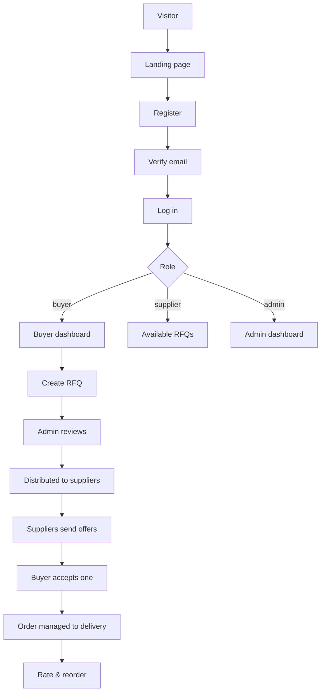
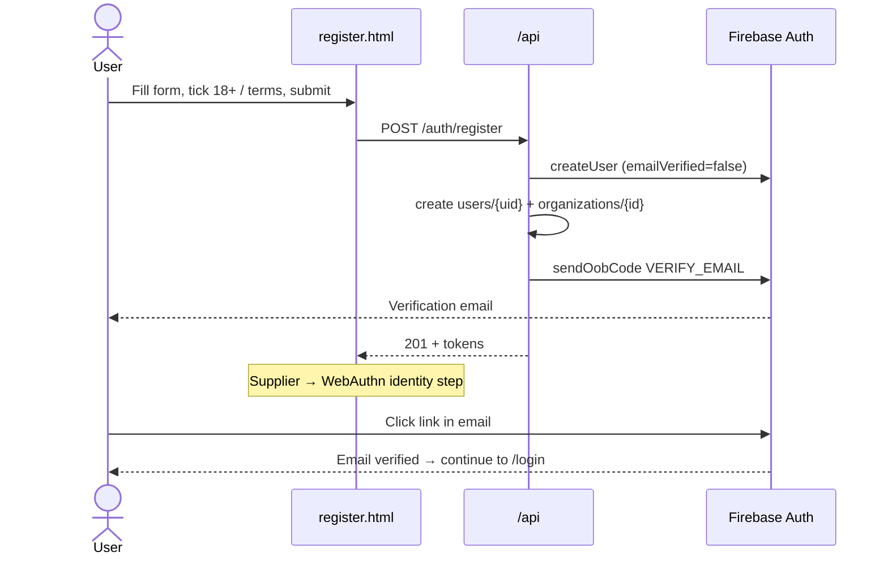
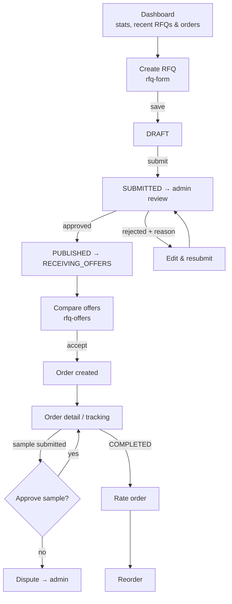
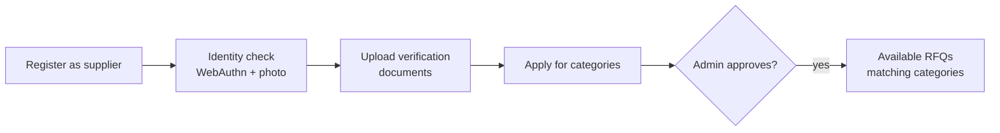
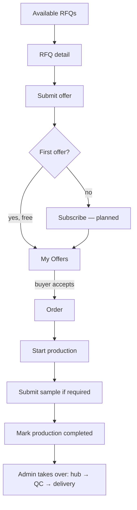
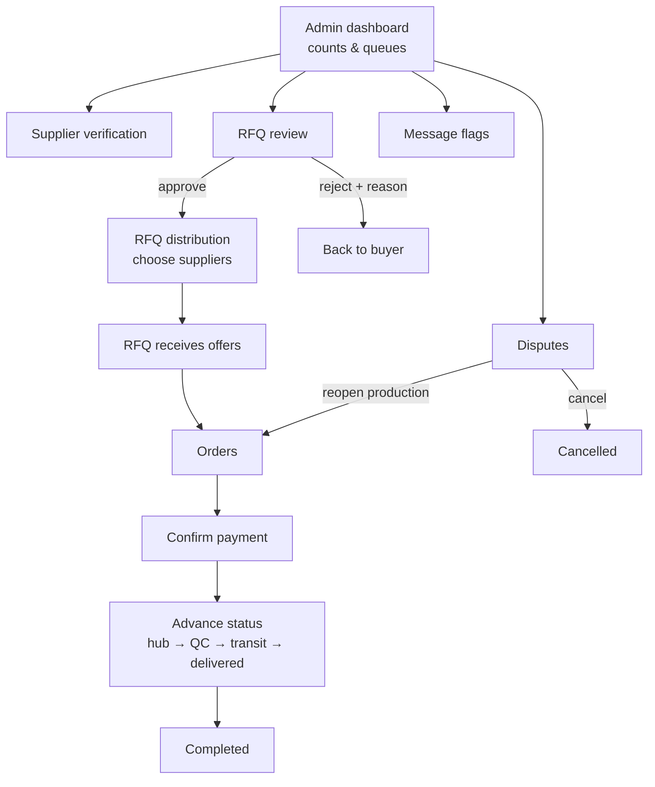

# Waradly — App Flow

How each type of user moves through Waradly, page by page, with the API call behind each step. Diagrams use Mermaid (they render on GitHub and in VS Code's Markdown preview with a Mermaid extension).

| | |
|---|---|
| **Last updated** | 30 September 2026 |
| **Related docs** | [TRD.md](TRD.md) · [IMPLEMENTATION_PLAN.md](IMPLEMENTATION_PLAN.md) · [TESTING.md](TESTING.md) |

Page paths are under `public-web/`. With `cleanUrls`, `/buyer/rfqs.html` is served as `/buyer/rfqs`.

---

## 1. The whole journey at a glance

## 2. Public site and accounts

### 2.1 Landing page (`/`)
- Header: logo, section links, **Log in** and **Sign up** (top right).
- "Post your first RFQ" → `/register`. "Join as a supplier" → `/register?role=supplier` (Supplier pre-selected).

### 2.2 Registration and verification

- Validation errors are shown per field (e.g. "Password must be at least 8 characters.").
- Suppliers go through a one-time **identity verification** (device biometrics via WebAuthn + photo) right after registering.
- If the email link opens `/verify-email?oobCode=…`, the page calls `POST /auth/verify-email`. With `mode=resetPassword` it forwards to `/reset-password`.

### 2.3 Log in (`/login`)
1. `POST /auth/login` → tokens stored in the browser.
2. Redirect by role: buyer → `/buyer/dashboard`, supplier → `/supplier/rfqs`, admin → `/admin/index`.
3. Blocked if: wrong password (after 5 failures → locked 15 minutes), email not verified, or account suspended/banned (modal shows the reason).
4. If the user is already signed in, visiting `/login` sends them straight to their dashboard.

### 2.4 Forgot / reset password
`/forgot-password` → `POST /auth/password-reset-request` (always answers "sent", so emails can't be probed) → email link → `/reset-password?token=…` → `POST /auth/password-reset` → all sessions revoked → log in again.

### 2.5 Every protected page
1. `requireRole(...)` calls `GET /users/me`. No session → `/login`. Wrong role → that role's dashboard.
2. `mountShell()` draws the sidebar (desktop) or slide-out menu (phone).
3. A `401` on any call tries one token refresh, then signs out to `/login`.

## 3. Buyer flow

| Step | Page | API |
|---|---|---|
| See overview | `buyer/dashboard` | `GET /rfqs`, `GET /orders` |
| Create / edit RFQ | `buyer/rfq-form` | `POST /rfqs`, `PATCH /rfqs/:id`, `POST /files` |
| Submit for review | `buyer/rfq-form` | `PATCH /rfqs/:id/submit` |
| List RFQs | `buyer/rfqs` | `GET /rfqs` |
| RFQ detail / cancel | `buyer/rfq-detail` | `GET /rfqs/:id`, `PATCH /rfqs/:id/cancel` |
| Compare & accept offers | `buyer/rfq-offers` | `GET /rfqs/:id/offers`, `PATCH /offers/:id/accept` |
| Orders | `buyer/orders`, `buyer/order-detail`, `buyer/order-tracking` | `GET /orders`, `GET /orders/:id` |
| Sample decision | `buyer/order-detail` | `PATCH /orders/:id/samples/decision` |
| Rate / reorder | `buyer/order-rate`, `buyer/order-detail` | `POST /orders/:id/rate`, `POST /orders/:id/reorder` |
| Profile | `buyer/profile` | `GET/PATCH /users/me`, `POST /users/me/avatar`, `GET/PATCH /organizations/me` |

Rules the buyer meets: RFQs are editable only while `DRAFT` or `SUBMITTED`; creating an RFQ requires a verified email; supplier identities are always anonymised ("Supplier #1").

## 4. Supplier flow

**4.1 Onboarding**

**4.2 Offers and orders**

| Step | Page | API |
|---|---|---|
| Verification | `supplier/verification` | `POST /files`, `POST /suppliers/verification-documents`, `GET /suppliers/me` |
| Categories | `supplier/categories` | `GET /categories`, `GET/POST /suppliers/categories` |
| RFQ feed | `supplier/rfqs` | `GET /rfqs` (eligible RFQs only) |
| RFQ detail | `supplier/rfq-detail` | `GET /rfqs/:id` |
| Submit / edit offer | `supplier/offer-form` | `POST /rfqs/:id/offers`, `PATCH /offers/:id` |
| My offers / withdraw | `supplier/offers` | `GET /offers`, `PATCH /offers/:id/withdraw` |
| Orders & production | `supplier/orders`, `supplier/order-detail` | `GET /orders`, `PATCH /orders/:id/mark-production-started`, `POST /orders/:id/samples`, `PATCH /orders/:id/mark-production-completed` |
| Performance | `supplier/performance` | `GET /suppliers/me` (anonymised ID, completed orders, average rating) |

Rules the supplier meets: one active offer per RFQ; offers refused after the offer deadline; editable only while `SUBMITTED` or `UNDER_REVIEW`; buyer identity always hidden (only display name and general region).

**Planned — subscription:** after the first free offer, submitting another requires an active subscription (500 EGP/month or 4,800 EGP/year via Paymob). Flow: `supplier/subscription` → choose plan → Paymob hosted checkout → Paymob calls the backend with a signed confirmation → subscription active → offers allowed again. See [IMPLEMENTATION_PLAN.md](IMPLEMENTATION_PLAN.md) Phase 3.

## 5. Admin flow

| Task | Page | API |
|---|---|---|
| Overview | `admin/index` | `GET /admin/dashboard` |
| Approve suppliers | `admin/suppliers-verification` | `GET /admin/suppliers/verification`, `PATCH /admin/suppliers/:id/verification`, `GET /files/:id/original` |
| Review RFQs | `admin/rfqs-review` | `GET /admin/rfqs/review`, `PATCH /admin/rfqs/:id/approve`, `PATCH /admin/rfqs/:id/reject` |
| Distribute RFQ | `admin/rfq-distribution` | `GET/PATCH /admin/rfqs/:id/distribution`, `PATCH /admin/rfqs/:id/notes` |
| Offers | `admin/offers` | `GET /admin/offers`, `PATCH /admin/offers/:id/flag` |
| Orders | `admin/orders`, `admin/order-detail` | `GET /admin/orders(/:id)`, `PATCH …/confirm-payment`, `PATCH …/status`, `PATCH …/notes` |
| Categories | `admin/categories` | `/admin/categories` CRUD |
| Users | `admin/users`, `admin/user-detail` | `GET /admin/users(/:id)`, `PATCH …/suspend`, `…/ban`, `…/reactivate` |
| Message flags | `admin/messages-flags` | `GET /admin/messages/flags`, `PATCH /admin/messages/flags/:c/:m/:f` |
| Disputes | `admin/disputes` | `GET /admin/disputes`, `PATCH /admin/disputes/:id/resolve` |
| Audit log | `admin/audit-logs` | `GET /admin/audit-logs` |

## 6. Order lifecycle (who moves each step)

| From → To | Who | Evidence |
|---|---|---|
| — → `OFFER_SELECTED` | Buyer accepts offer | |
| → `PENDING_PAYMENT` → `PAYMENT_CONFIRMED` | Admin | |
| → `PRODUCTION` | Supplier (start production) | |
| `PRODUCTION` → `SAMPLE_REVIEW` | Supplier submits sample | Sample files |
| `SAMPLE_REVIEW` → `PRODUCTION` / `DISPUTED` | Buyer approves / rejects | |
| → `PRODUCTION_COMPLETED` | Supplier | |
| → `RECEIVED_AT_HUB` → `QC_COMPLETED` → `READY_FOR_DELIVERY` → `IN_TRANSIT` → `DELIVERED` | Admin | Required at hub, QC and delivery |
| → `COMPLETED` | Admin / on completion | Buyer can then rate |
| `DISPUTED` → `PRODUCTION` / `CANCELLED` | Admin resolves | |

## 7. Messaging

Opened from an RFQ or order page → `messages/conversation`. Messages go through `POST /conversations/:id/messages`. Emails, URLs and phone numbers are masked before storing and flagged; admins review flags in `admin/messages-flags`. Buyer and supplier see each other only by anonymised labels.

## 8. Notifications and emails

| Event | In-app | Email |
|---|---|---|
| Account created | ✓ | Verification email (Firebase mailer) |
| Password reset requested | ✓ | Reset email (Firebase mailer) |
| New offer on buyer's RFQ | ✓ | |
| Other key events (RFQ decisions, order updates) | ✓ | Via Resend where configured |

## 9. Error and edge paths

| Situation | What the user sees |
|---|---|
| Invalid form input | Each failing field's message listed above the form |
| Session expired | One silent refresh, then redirect to `/login` |
| Wrong role for a page | Redirect to own dashboard |
| Suspended/banned at login | Modal with the reason |
| Supplier without supplier organization | "Your account isn't set up as a supplier organization" instead of an endless "Loading…" |
| Offer after deadline | "The offer deadline for this RFQ has passed." |
| Unknown URL | Served the landing page (Hosting catch-all rewrite) |

## 10. Planned: Arabic

A language switch in the header/sidebar toggles the whole site between English and Arabic, flipping the layout right-to-left and using an Arabic font. The choice is remembered per browser. See [IMPLEMENTATION_PLAN.md](IMPLEMENTATION_PLAN.md) Phase 4.
