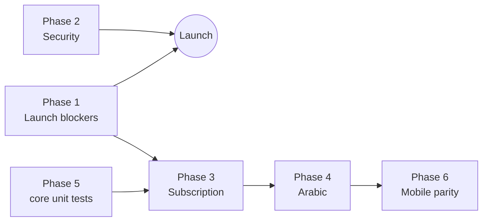

# Waradly — Implementation Plan

What is left to build, in order, with the files each task touches and how to know it's done.

| | |
|---|---|
| **Last updated** | 30 September 2026 |
| **Related docs** | [TRD.md](TRD.md) · [APP_FLOW.md](APP_FLOW.md) · [TESTING.md](TESTING.md) |

Every task follows the same loop: build → test (per [TESTING.md](TESTING.md)) → `firebase deploy --only "functions,hosting"` → check on `waradly-1.web.app`.

---

## Phase 0 — Done ✅

| Area | What exists |
|---|---|
| Platform | Buyer, supplier and admin flows end to end: RFQs, offers, orders, disputes, ratings, messaging, notifications, audit log |
| Website | Landing page, redesigned buyer dashboard, Watermelon-style design, Waradly logo and favicon on every page |
| Email | Verification/reset emails reach every inbox via Firebase's mailer; branded HTML for Resend emails |
| UX | Field-level error messages on every form; supplier RFQ page no longer hangs on errors |
| Compliance | Self-hosted font; 18+ business confirmation at sign-up |
| SEO | Titles, descriptions, canonical tags, sitemap.xml, robots.txt, Search Console verified |
| Infra | Backend on Node.js 22 (deployed before the 30 Oct 2026 Node 20 shutdown); CSS/JS revalidated on every visit |

---

## Phase 1 — Launch blockers

Must be done before real users sign up.

| # | Task | Files / where | Done when |
|---|---|---|---|
| 1.1 | **RFQ auto-expiry job.** Scheduled function (every hour) that moves `PUBLISHED` / `RECEIVING_OFFERS` RFQs past `offer_deadline_at` to `EXPIRED`, expires their open offers, audit-logs and notifies the buyer. | New `functions/jobs/expireRfqs.js`; export `onSchedule` in `functions/index.js`; reuse `canTransitionRfq` | An RFQ with a past deadline shows `EXPIRED` within an hour; a unit test covers the selection logic |
| 1.2 | **Legal pages.** Terms, Privacy Policy, Anti-Circumvention Policy (text from a lawyer). Link them from the sign-up checkbox and the landing footer. | New `public-web/terms.html`, `privacy.html`, `anti-circumvention.html`; `register.html`; `index.html` footer; add to `sitemap.xml` | Pages live; links open from the checkbox and footer |
| 1.3 | **Custom domain.** Buy a domain, connect it in Firebase Hosting, then update `APP_BASE_URL`, canonical tags, `sitemap.xml`, `robots.txt`, and add the domain to Search Console. | Firebase console; `functions/.env.waradly-1`; public HTML heads; SEO files | Site loads on the domain with SSL; old URL still works |
| 1.4 | **Email from own domain.** Verify the domain in Resend (SPF, DKIM, DMARC), set `EMAIL_FROM=no-reply@<domain>`. Emails switch to Resend automatically. | Resend dashboard; `functions/.env.waradly-1` | Test email lands in the Gmail inbox, not spam, with a clickable button |
| 1.5 | **Firebase console settings.** Auth email action URL → `https://<domain>/verify-email`; sender name "Waradly". Blaze budget alert. | Firebase / Google Cloud console | Verification link opens the Waradly page; budget alert configured |
| 1.6 | **First admin + category.** Create the admin account (set `role: "admin"` on its `users` doc) and activate at least one product category. | Firestore console | Admin can log in; suppliers can apply for the category |
| 1.7 | **Search Console.** Submit `sitemap.xml`; request indexing for the home page. | Search Console | Sitemap status "Success" |

## Phase 2 — Security hardening

| # | Task | Files | Done when |
|---|---|---|---|
| 2.1 | **Restrict CORS** to the site's own origins (currently `origin: true` allows any website to call the API from a browser). | `functions/app.js` | Requests from another origin are rejected; site and app still work |
| 2.2 | **Rate-limit** `register`, `password-reset-request`, `verify-email` and message sending (per IP / per user, e.g. counters in Firestore with a time window). | `functions/middleware/rateLimit.js` (new); auth and conversation routes | Burst of requests gets `429 RATE_LIMITED` |
| 2.3 | **Security headers** on Hosting: `Content-Security-Policy`, `Strict-Transport-Security`, `X-Content-Type-Options`, `Referrer-Policy`, `X-Frame-Options`. | `firebase.json` → `hosting.headers` | Headers visible on every response; site still renders |
| 2.4 | **Dependency audit.** `npm audit` in `functions/`; upgrade `firebase-functions` (5.1.1) and `firebase-admin` (12.7.0) to current majors and retest. | `functions/package.json` | No high/critical advisories; all tests pass |
| 2.5 | **Backups.** Enable Firestore point-in-time recovery or scheduled exports to Cloud Storage. | Google Cloud console | Restore procedure written down and tried once |
| 2.6 | **Error hygiene.** Confirm the error handler never returns stack traces or internal messages for unexpected errors. | `functions/http/errorHandler.js` | Forced 500 returns a generic message |

## Phase 3 — Supplier subscription (Paymob)

**Rule:** a supplier's first offer is free; after that, submitting an offer requires an active subscription. Prices: **500 EGP/month** or **4,800 EGP/year** (20% off 6,000). One-time payment per period, **no auto-renewal**.

### 3.1 Backend
| # | Task | Files |
|---|---|---|
| 3.1.1 | `subscriptionService.js`: plan constants; `isActive(org)` (`org.subscription.active_until > now`); `countOffers(orgId)` via Firestore `count()`; `assertCanSubmitOffer(org)` → throws `402 SUBSCRIPTION_REQUIRED` when offers ≥ 1 and not active | `functions/services/subscriptionService.js` |
| 3.1.2 | Enforce in `POST /rfqs/:id/offers` before creating the offer | `functions/routes/rfqs.routes.js` |
| 3.1.3 | `GET /subscriptions/me` → status, `active_until`, offer count, `requires_subscription`, plans | `functions/routes/subscriptions.routes.js` (new), mount in `app.js` |
| 3.1.4 | `POST /subscriptions/checkout {plan}` → create `subscription_payments/{id}` (`pending`, amount in piastres), call Paymob `POST https://accept.paymob.com/v1/intention/` with `Authorization: Token <secret>`, `amount`, `currency: "EGP"`, `payment_methods`, `billing_data`, `special_reference = payment id`, `notification_url = <APP_BASE_URL>/api/subscriptions/paymob/webhook`, `redirection_url = <APP_BASE_URL>/supplier/subscription?payment=<id>` → return `https://accept.paymob.com/unifiedcheckout/?publicKey=…&clientSecret=…` | same |
| 3.1.5 | `POST /subscriptions/paymob/webhook` (no auth): verify **HMAC-SHA512** of the 20 transaction fields in Paymob's fixed order (`amount_cents, created_at, currency, error_occured, has_parent_transaction, id, integration_id, is_3d_secure, is_auth, is_capture, is_refunded, is_standalone_payment, is_voided, order.id, owner, pending, source_data.pan, source_data.sub_type, source_data.type, success`) against `?hmac=`; reject if invalid; if `success && !pending`, look up the payment by `obj.order.merchant_order_id`, check the amount matches, and in a transaction mark it `paid` (idempotent) and extend `active_until = max(now, current) + 1 or 12 months`; audit-log | same |
| 3.1.6 | Env vars: `PAYMOB_SECRET_KEY`, `PAYMOB_PUBLIC_KEY`, `PAYMOB_INTEGRATION_IDS`, `PAYMOB_HMAC_SECRET`; checkout returns a clear error if missing | `functions/.env.waradly-1` |

### 3.2 Frontend
| # | Task | Files |
|---|---|---|
| 3.2.1 | Subscription page: two plan cards (monthly, annual "save 20%"), current status and expiry, renewal note beside the button ("One-time payment — does not renew automatically"), handles return from Paymob by polling `GET /subscriptions/me` | `public-web/supplier/subscription.html` (new) |
| 3.2.2 | Sidebar item "Subscription" under Account for suppliers | `public-web/assets/js/shell.js` |
| 3.2.3 | After the first offer is sent, show a "Subscribe to keep sending offers" prompt; on `SUBSCRIPTION_REQUIRED`, show the message with a Subscribe button | `public-web/supplier/offer-form.html` |
| 3.2.4 | Admin: show subscription status on supplier user detail | `public-web/admin/user-detail.html` |

**Done when:** a sandbox Paymob payment activates the subscription; a tampered webhook (bad HMAC) is rejected; a replayed webhook does not double-extend; a second offer without a subscription is refused with `SUBSCRIPTION_REQUIRED`.

**Needs from the business:** a Paymob merchant account (test keys first, then live).

## Phase 4 — Arabic version (whole website)

| # | Task | Files |
|---|---|---|
| 4.1 | `i18n.js`: English → Arabic dictionary keyed by the English text; translates text nodes and `placeholder` / `title` / `aria-label` attributes on load and on DOM changes (MutationObserver) so JS-rendered content is covered; pattern entries for dynamic strings ("1 receiving offers"); translates server error messages client-side | `public-web/assets/js/i18n.js` (new), included on every page |
| 4.2 | Language switch (English / العربية) in the landing header, sidebar and auth pages; choice saved in `localStorage`; sets `<html lang="ar" dir="rtl">` | `index.html`, `shell.js`, auth pages |
| 4.3 | RTL CSS: replace `left`/`right` with logical properties (`inset-inline-start`, `margin-inline`, `padding-inline`, `text-align: start`); mirror directional icons (arrows) | `theme.css`, `index.html` styles |
| 4.4 | Self-hosted Arabic font (e.g. IBM Plex Sans Arabic or Cairo, open-source) applied when `lang="ar"` | `public-web/assets/fonts/`, `theme.css` |
| 4.5 | Dates and numbers via `toLocaleDateString('ar-EG')` when Arabic is on | `public-web/assets/js/util.js` |
| 4.6 | Translate all strings across ~41 pages (extract with a script, translate, review by a native speaker) | dictionary file |
| 4.7 | Arabic SEO: `hreflang` alternates on public pages | public HTML heads |

**Done when:** every page reads fully in Arabic with correct right-to-left layout on desktop and phone, and switching back to English restores everything.

## Phase 5 — Automated tests

See [TESTING.md](TESTING.md) §3. Port the five old `tests/*.test.ts` (written for the retired Next.js code) to `functions/test/*.test.js` using Node's built-in test runner, then add emulator-based API tests for auth, RFQ, offer, order and subscription flows.

## Phase 6 — Mobile app parity

| # | Task |
|---|---|
| 6.1 | Show field-level validation errors (same `fields` envelope) |
| 6.2 | Subscription status + checkout (open Paymob URL in the browser) |
| 6.3 | Arabic + RTL (Flutter `intl`, `Directionality`) |
| 6.4 | Publish: Google Play ($25 one time), App Store ($99 per year) |

---

## Order and dependencies

- Phase 3 depends on 1.3 (domain for `APP_BASE_URL` in Paymob callbacks) and a Paymob merchant account.
- Phase 4 comes after Phase 3 so the new subscription pages are translated too.
- Write the unit tests for the subscription service (HMAC, eligibility) **with** Phase 3, not after.
