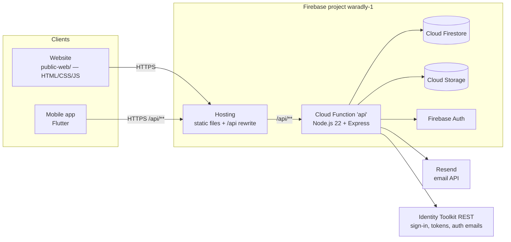
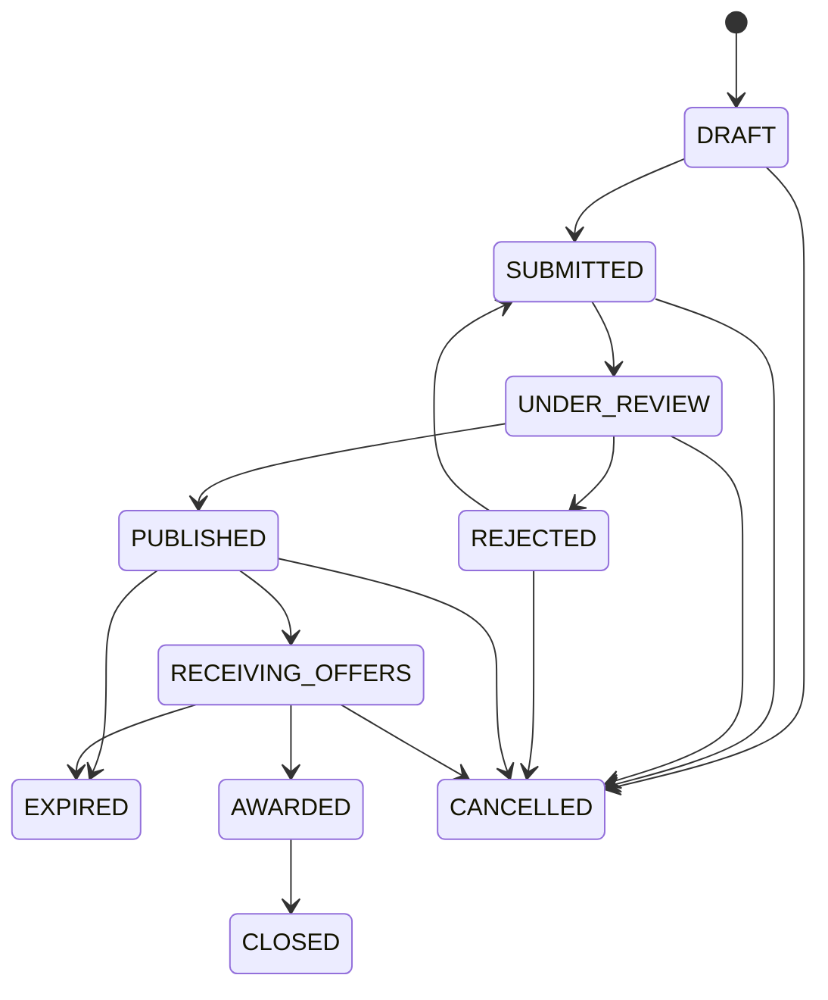
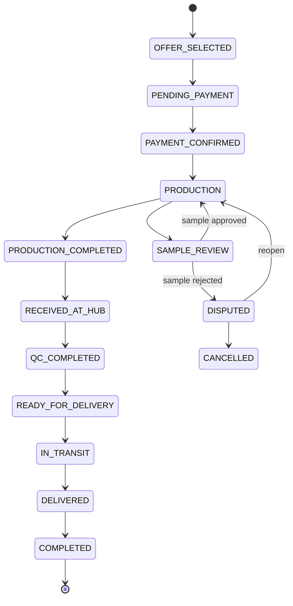

# Waradly — Technical Requirements Document (TRD)

| | |
|---|---|
| **Product** | Waradly — B2B procurement marketplace |
| **Environment** | Production: `https://waradly-1.web.app` (Firebase project `waradly-1`) |
| **Last updated** | 30 September 2026 |
| **Related docs** | [APP_FLOW.md](APP_FLOW.md) · [IMPLEMENTATION_PLAN.md](IMPLEMENTATION_PLAN.md) · [TESTING.md](TESTING.md) · [SPEC.md](../SPEC.md) (business rules) |

Status labels: **Live** = in production · **Planned** = agreed, not built · **Gap** = known missing piece.

---

## 1. Purpose and scope

This document defines *how* Waradly is built: architecture, data model, API, state machines, security and non-functional requirements. Business rules (what the product must do and why) live in [SPEC.md](../SPEC.md); where the two differ, the running code in `functions/` and `public-web/` is the source of truth for current behaviour.

In scope: the website (`public-web/`), the backend (`functions/`), the Flutter mobile app (`mobile/`), Firebase configuration, and third-party integrations.

## 2. System overview

A buyer posts a Request for Quotation (RFQ). Waradly's admin team reviews it and distributes it to verified suppliers approved for that category. Suppliers submit competing offers; the buyer accepts one, which creates an order. Admin manages the order through payment, production, hub, quality check and delivery; it closes with a rating. **Buyers and suppliers never see each other's real identity or contact details.**

### 2.1 Architecture



Key architectural decisions:

| Decision | Reason |
|---|---|
| **All data access goes through the Express API** (Admin SDK). Clients never talk to Firestore or Storage directly. | One place for permissions, identity masking and audit logging. Firestore and Storage security rules deny everything as a backstop. |
| **No client-side Firebase SDK.** Login, token refresh and auth emails use the Identity Toolkit REST API from the server. | Web and Flutter share one simple HTTP API; no Firebase SDK in either client. |
| **Plain HTML/CSS/JS website, no build step.** | Files deploy as-is; low complexity. |
| **Single Cloud Function (`api`) serving an Express app.** | One deployment unit; routes mounted under `/api`. |

## 3. Technology stack

| Layer | Technology | Version / notes |
|---|---|---|
| Hosting | Firebase Hosting | `cleanUrls: true`; `/api/**` → function; `**` → `index.html`; CSS/JS served `Cache-Control: no-cache` |
| Backend runtime | Cloud Functions 2nd gen | **Node.js 22** (`functions/package.json` engines), region `us-central1`, 256 MB |
| Backend framework | Express 4, zod (validation), cors | |
| Firebase SDKs | firebase-functions 5.1.1, firebase-admin 12.7.0 | |
| Database | Cloud Firestore | Deny-all rules (`firestore.rules`) |
| File storage | Cloud Storage for Firebase | Deny-all rules (`storage.rules`); access only via signed URLs |
| Auth | Firebase Authentication (email/password) + Identity Toolkit REST | |
| Identity check | WebAuthn via `@simplewebauthn/server` | One-time supplier verification |
| Files | `sharp` (images), `pdf-lib` (PDFs), `busboy` (uploads) | Watermarking and validation |
| Email | Resend (transactional) + Firebase Auth mailer (verify/reset) | See §9.4 |
| Website | HTML, CSS (`assets/css/theme.css`), vanilla JS (`assets/js/`) | Self-hosted Outfit font |
| Mobile | Flutter | `mobile/lib/` |
| Tooling | Firebase CLI 15.x, Emulator Suite | |

## 4. Roles and permissions

| Role | How created | Can |
|---|---|---|
| **Buyer** | Self-registration | Create/edit/submit/cancel RFQs; compare and accept offers; view own orders; approve/reject samples; rate; reorder; message |
| **Supplier** | Self-registration + identity verification + admin approval per category | View eligible RFQs; submit/edit/withdraw offers; production actions on won orders; upload verification documents; apply for categories; message |
| **Admin** | Never self-registrable — set `role: "admin"` on the user document | Everything under `/api/admin/**`: review RFQs and suppliers, distribution, orders, disputes, users, categories, message flags, audit log |

Enforcement: `middleware/authenticate.js` verifies the Firebase ID token (with revocation check) **and re-reads `users/{uid}` on every request**, rejecting any status other than `active`. `middleware/requireRole.js` gates each route.

## 5. Functional requirements

| ID | Requirement | Status |
|---|---|---|
| FR-01 | Register as buyer or supplier with email, username, phone, password, company legal name, country, region, and an 18+ business/terms confirmation | Live |
| FR-02 | Email verification required before login; verification email reaches any inbox | Live |
| FR-03 | Login with lockout after repeated failures; token refresh; logout revokes sessions | Live |
| FR-04 | Password reset by email | Live |
| FR-05 | Supplier one-time identity verification (WebAuthn + photo) and document upload | Live |
| FR-06 | Supplier applies for categories; admin approves per category | Live |
| FR-07 | Buyer creates RFQ (draft), edits before submit, attaches files, submits for review | Live |
| FR-08 | Admin approves/rejects RFQs with reason; controls distribution to eligible suppliers | Live |
| FR-09 | Supplier submits one active offer per RFQ; edits before deadline; withdraws | Live |
| FR-10 | Buyer compares offers (supplier anonymised) and accepts one atomically → order | Live |
| FR-11 | Order lifecycle managed by admin with status history and evidence | Live |
| FR-12 | Sample review: supplier submits, buyer approves (back to production) or rejects (dispute) | Live |
| FR-13 | Disputes resolved by admin: reopen production or cancel | Live |
| FR-14 | Rating after completion; reorder | Live |
| FR-15 | Messaging through the platform with contact-detail detection and admin flag review | Live |
| FR-16 | In-app notifications; email notifications | Live |
| FR-17 | Admin dashboard, user suspension/ban/reactivation, audit log | Live |
| FR-18 | Public landing page, SEO (titles, descriptions, sitemap, robots.txt) | Live |
| FR-19 | RFQs past their offer deadline are automatically marked `EXPIRED` | **Gap** — no scheduled job exists in `functions/jobs/` |
| FR-20 | Supplier subscription: first offer free, then 500 EGP/month or 4,800 EGP/year via Paymob | **Planned** |
| FR-21 | Full Arabic version of the website (RTL, language switch) | **Planned** |
| FR-22 | Terms, Privacy and Anti-Circumvention pages linked from sign-up | **Gap** — referenced but not published |

## 6. Data model (Cloud Firestore)

All documents are read and written only by the backend. Timestamps are Firestore `Timestamp`s, serialised to clients as `{_seconds, _nanoseconds}`.

| Collection | Purpose | Notable fields |
|---|---|---|
| `users/{uid}` | Profile mirror of the Auth user | `email`, `phone`, `username`, `role`, `status`, `status_reason`, `email_verified`, `failed_login_attempts`, `locked_until`, `avatar_storage_key`, `webauthn_challenge*` |
| `users/{uid}/webauthn_credentials` | Registered passkeys | |
| `organizations/{id}` | One company per user (`owner_uid`) | `type` (buyer/supplier), `legal_name`, `country`, `general_region`, `supplier_profile.verification_status` |
| `organizations/{id}/verification_documents`, `category_applications` | Supplier onboarding | |
| `categories/{id}` | Product categories | active flag |
| `rfqs/{id}` | Requests for quotation | `buyer_id`, `category_id`, `title`, `quantity`, `unit`, specs fields, `delivery_deadline`, `delivery_region`, `status`, `offer_deadline_at`, `published_at`, `rejection_reason`, `admin_notes` |
| `rfqs/{id}/items`, `attachments`, `distribution_overrides` | RFQ sub-data | |
| `offers/{id}` | Supplier offers | `rfq_id`, `supplier_id`, `unit_price`, `moq`, lead times, sample/payment terms, `status` |
| `offers/{id}/items`, `attachments` | Offer sub-data | |
| `orders/{id}` | Orders | `rfq_id`, `offer_id`, `buyer_id`, `supplier_id`, `status`, `sample_required` |
| `orders/{id}/status_history` | Append-only status log | |
| `ratings` | Post-completion ratings | |
| `disputes` | Disputes | outcome: `reopen_production` / cancel |
| `conversations/{id}/messages/{id}/flags` | Messages and contact-detection flags | |
| `files/{id}` | File metadata and ownership | |
| `notifications` | In-app notifications | |
| `audit_logs` | Append-only audit trail | `actorId`, `action`, `entityType`, `entityId`, `before`, `after` |
| `counters` | Anonymised ID sequences | |

## 7. API

Base path `/api`. JSON in and out. Authenticated routes need `Authorization: Bearer <Firebase ID token>`. Errors use one envelope:

```json
{ "error": { "code": "VALIDATION_ERROR", "message": "Validation failed.", "fields": { "password": "Password must be at least 8 characters." } } }
```

Error codes: `UNAUTHENTICATED` 401 · `FORBIDDEN` 403 · `NOT_FOUND` 404 · `CONFLICT` 409 · `VALIDATION_ERROR` 422/400 · `RATE_LIMITED` 429 · `UPLOAD_FAILED` 502.

| Area | Endpoints |
|---|---|
| Health | `GET /health` |
| Auth | `POST /auth/register` · `POST /auth/login` · `POST /auth/refresh` · `POST /auth/logout` · `POST /auth/password-reset-request` · `POST /auth/password-reset` · `POST /auth/verify-email` |
| WebAuthn | `POST /auth/webauthn/register-options` · `POST /auth/webauthn/register-verify` · `GET /auth/webauthn/credentials` · `DELETE /auth/webauthn/credentials/:id` |
| Users | `GET/PATCH /users/me` · `POST/DELETE /users/me/avatar` · `GET /users/:id/avatar` |
| Organizations | `GET/PATCH /organizations/me` · `GET /organizations/:id` |
| Files | `POST /files` · `DELETE /files/:id` · `GET /files/:id/original` · `GET /files/:id/preview` |
| Categories | `GET /categories` · admin: `GET/POST /admin/categories`, `PATCH /admin/categories/:id`, activate/deactivate |
| Suppliers | `GET /suppliers/me` · `GET/POST /suppliers/categories` · `POST /suppliers/verification-documents` · `GET /suppliers/:id` |
| Admin suppliers | `GET /admin/suppliers/verification` · `PATCH /admin/suppliers/:id/verification` · `GET /admin/suppliers/:id/categories` · `PATCH /admin/suppliers/:id/categories/:categoryId` |
| RFQs | `POST /rfqs` · `GET /rfqs` · `GET/PATCH /rfqs/:id` · `PATCH /rfqs/:id/submit` · `PATCH /rfqs/:id/cancel` · `GET /rfqs/:id/history` · `POST/GET /rfqs/:id/offers` |
| Admin RFQs | `GET /admin/rfqs/review` · `PATCH /admin/rfqs/:id/approve` · `PATCH /admin/rfqs/:id/reject` · `PATCH /admin/rfqs/:id/notes` · `GET/PATCH /admin/rfqs/:id/distribution` |
| Offers | `GET /offers` · `GET/PATCH /offers/:id` · `PATCH /offers/:id/withdraw` · `PATCH /offers/:id/accept` |
| Admin offers | `GET /admin/offers` · `PATCH /admin/offers/:id/flag` |
| Orders | `GET /orders` · `GET /orders/:id` · `PATCH /orders/:id/mark-production-started` · `PATCH /orders/:id/mark-production-completed` · `POST /orders/:id/samples` · `PATCH /orders/:id/samples/decision` · `POST /orders/:id/rate` · `POST /orders/:id/reorder` |
| Admin orders | `GET /admin/orders` · `GET /admin/orders/:id` · `PATCH /admin/orders/:id/notes` · `PATCH /admin/orders/:id/confirm-payment` · `PATCH /admin/orders/:id/status` |
| Messaging | `GET/POST /conversations` · `GET/POST /conversations/:id/messages` · admin: `GET /admin/messages/flags`, `PATCH /admin/messages/flags/:conversationId/:messageId/:flagId` |
| Disputes | `GET/POST /admin/disputes` · `GET /admin/disputes/:id` · `PATCH /admin/disputes/:id/resolve` |
| Notifications | `GET /notifications` · `PATCH /notifications/:id/read` · `PATCH /notifications/read-all` |
| Admin | `GET /admin/dashboard` · `GET /admin/audit-logs` · `GET /admin/users` · `GET /admin/users/:id` · `PATCH /admin/users/:id/suspend` · `PATCH /admin/users/:id/ban` · `PATCH /admin/users/:id/reactivate` |

## 8. State machines

Defined in `functions/stateMachines/`. Any transition not listed is rejected.

**RFQ** (`rfq.js`) — editable only in `DRAFT` and `SUBMITTED`.



**Offer** (`offer.js`): `SUBMITTED → UNDER_REVIEW → ACCEPTED | REJECTED | WITHDRAWN | EXPIRED` (also direct from `SUBMITTED`). Editable in `SUBMITTED` and `UNDER_REVIEW`.

**Order** (`order.js`):



Any active state from `OFFER_SELECTED` to `PRODUCTION` can go to `CANCELLED`; any from `PRODUCTION` to `DELIVERED` can go to `DISPUTED`. `RECEIVED_AT_HUB`, `QC_COMPLETED` and `DELIVERED` require evidence uploads. Admin can force a status but every forced change is audit-logged with a reason.

## 9. Non-functional requirements

### 9.1 Security

| Requirement | Implementation |
|---|---|
| Authentication | Firebase ID tokens verified with revocation check on every request; user doc re-read each request so suspensions apply immediately |
| Brute-force protection | 5 failed logins → 15-minute lockout (`lockoutService.js`) |
| Passwords | ≥ 8 characters with at least one letter and one number |
| Authorisation | Role checks per route; ownership checks per resource |
| Database access | Firestore rules deny all client access; `audit_logs` and `status_history` append-only |
| File access | Storage rules deny all; files served only via 5-minute signed URLs after ownership checks |
| Upload validation | PNG, JPEG, PDF only; 10 MB max; magic-byte signature check; filename sanitised; image-pixel and 50-page PDF bomb guards |
| Identity masking | Per-viewer serialisers in `functions/masking/`; anonymised supplier IDs |
| Contact leakage | Messages scanned for emails, URLs and phone numbers; matches masked and flagged for admin |
| Secrets | Stored in `functions/.env.waradly-1` (git-ignored, never committed); no secrets in the website code |
| Audit | Every significant action written to `audit_logs` |
| **Gaps** | CORS allows any origin (`cors({ origin: true })`); no rate limiting on register or password-reset; no security headers (CSP, HSTS, X-Frame-Options) on Hosting — see [IMPLEMENTATION_PLAN.md](IMPLEMENTATION_PLAN.md) Phase 2 |

### 9.2 Performance and availability
- Function cold start plus code load under 2 seconds locally; deploy discovery must finish within the CLI's 10-second limit (raise with `FUNCTIONS_DISCOVERY_TIMEOUT` if needed).
- Static assets served from the Firebase CDN; CSS/JS revalidated on each visit (`no-cache` with ETag).
- Availability follows Firebase's service levels; no custom redundancy.

### 9.3 Privacy and compliance
- Outfit font self-hosted, so no visitor data goes to Google Fonts.
- No analytics or session replay.
- Sign-up requires confirming the user is 18+ and acting for a business (enforced server-side via `terms_accepted`).
- Only transactional emails are sent.

### 9.4 Email delivery
- While `EMAIL_FROM` is Resend's sandbox (`@resend.dev`), verification and reset emails are sent by **Firebase Auth's mailer** (`sendOobCode`) so they reach every inbox. Other notifications go through Resend.
- Once a custom domain is verified in Resend and `EMAIL_FROM` changes, all emails switch to Resend automatically (`usesFirebaseAuthMailer` in `emailChannelService.js`).
- Resend emails are sent as text + branded HTML.

### 9.5 Frontend
- Responsive from 360 px to desktop; the sidebar becomes a drawer below 768 px.
- Animations disabled under `prefers-reduced-motion`.
- Supported browsers: current Chrome, Edge, Safari, Firefox (desktop and mobile).

### 9.6 SEO
- Titles, meta descriptions and canonical URLs on public pages; Open Graph on the home page.
- `sitemap.xml` lists `/`, `/register`, `/login`; `robots.txt` disallows `/buyer/`, `/supplier/`, `/admin/`, `/messages/`.
- Auth utility pages are `noindex`. Google Search Console ownership verified.

## 10. Configuration

`functions/.env.waradly-1` (loaded automatically on deploy, never committed):

| Variable | Purpose |
|---|---|
| `WEB_API_KEY` | Identity Toolkit REST calls (public by design) |
| `APP_BASE_URL` | Builds links in emails (`https://waradly-1.web.app`) |
| `RESEND_API_KEY` | Resend email API |
| `EMAIL_FROM` | Sender address; `@resend.dev` means sandbox |
| `PAYMOB_SECRET_KEY`, `PAYMOB_PUBLIC_KEY`, `PAYMOB_INTEGRATION_IDS`, `PAYMOB_HMAC_SECRET` | **Planned** — supplier subscription |

## 11. Constraints and known gaps

1. Firebase **Blaze** plan required (Cloud Functions).
2. Emails come from shared addresses (Firebase / Resend sandbox) and may land in spam until a custom domain is verified.
3. No automated tests cover the live backend — see [TESTING.md](TESTING.md).
4. FR-19 (RFQ auto-expiry), FR-22 (legal pages) and the security gaps in §9.1 are open.
5. The mobile app is English-only and does not yet have the subscription flow.
